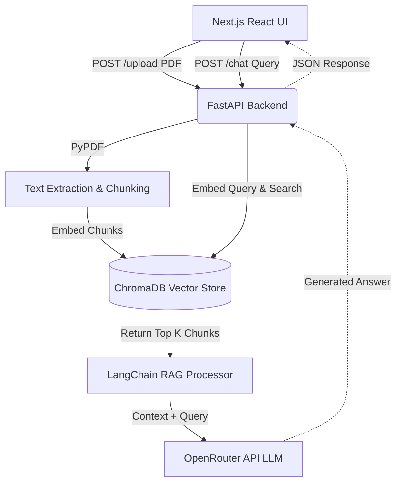

# DocuMind - AI PDF Chatbot

 <!-- Replace this with an actual screenshot in the future! -->

## 1. Summary of the project
DocuMind (or VaatBot) is a premium, web-based Retrieval-Augmented Generation (RAG) platform. It allows users to upload PDF documents and converse intelligently with an AI about the document's contents. Built with an extreme focus on user experience and aesthetics, the application wraps powerful natural language processing inside a stunning, responsive, and highly animated frontend.

## 2. Tech Stack
*   **Frontend**: 
    *   Next.js 15 (App Router)
    *   React 19
    *   Tailwind CSS (Styling)
    *   Framer Motion (Micro-animations and layout transitions)
    *   Lucide React (Iconography)
*   **Backend**: 
    *   FastAPI (Python API Framework)
    *   Uvicorn (ASGI Web Server)
    *   LangChain (AI Orchestration)
    *   ChromaDB (Local Vector Database)
    *   OpenRouter (LLM API Provider)
    *   HuggingFace Sentence Transformers (Local Embeddings)

## 3. Architecture Diagram


## 4. Flow of the Project
1.  **Ingestion Flow**: The user clicks the hero upload button and provides a PDF. The NextJS frontend securely POSTs this file to the FastAPI backend. FastAPI loads the PDF, splits the text into intelligent chunks, runs them through a HuggingFace embedding model, and saves the vectors locally in Chroma DB.
2.  **Generation Flow**: The user types a question in the chat interface. FastAPI embeds the query, executes a similarity search against Chroma DB to find the specific chunks containing the answer, and builds a strict prompt combining the context and the user's question. This prompt is pushed to an external LLM via OpenRouter, which generates an accurate response ensuring no hallucination outside the PDF context.

## 5. Folder Structure
```
AI-pdf-chatbot/
│
├── backend/                  # Python API
│   ├── main.py               # Core FastAPI endpoints & LangChain logic
│   ├── .env.example          # Environment variables template
│   ├── requirements.txt      # Python dependencies
│   ├── chroma_db/            # Local vector storage (auto-generated)
│   └── uploads/              # Temporary PDF storage (auto-generated)
│
└── frontend/                 # Next.js UI
    ├── src/
    │   └── app/
    │       ├── globals.css   # Global Tailwind and animated background styles
    │       ├── page.tsx      # Huge dynamic landing page and chat interfaces
    │       └── layout.tsx    # Next.js root layout
    ├── public/               # Static assets & generated 3D images
    ├── package.json
    └── tailwind.config.ts    # Tailwind theme configuration
```

## 6. Additional Features
- **Strict Anti-Hallucination**: The LLM prompt is engineered to *only* answer based on the provided PDF context. 
- **Persisted Vector Memory**: ChromaDB retains vectorized documents locally so the backend doesn't re-process data unnecessarily.
- **Dynamic 3D Aesthetics**: The UI is treated as a full-scale commercial landing page with 3D avatars, floating elements, and deep interactive states.

## 7. Timeline of the Project
- **Phase 1**: Initializing dual-repository structure and planning RAG pipeline architecture.
- **Phase 2**: Bootstrapping Python Backend (FastAPI, dependencies, Langchain abstractions).
- **Phase 3**: Creating the React/NextJS skeleton and wiring up core RAG API fetch loops.
- **Phase 4**: Major Visual Overhaul - Transforming the UI from a generic chat app to a highly animated, starry-themed digital product landing page.

## 8. Authors
- **Anisha Paturi** - Lead Developer & AI Enthusiast

---
> Note: If you encounter an `Is FastAPI running?` error, ensure you have renamed `.env.example` to `.env`, added your OpenRouter key, and explicitly restarted your `uvicorn main:app --reload` server!
