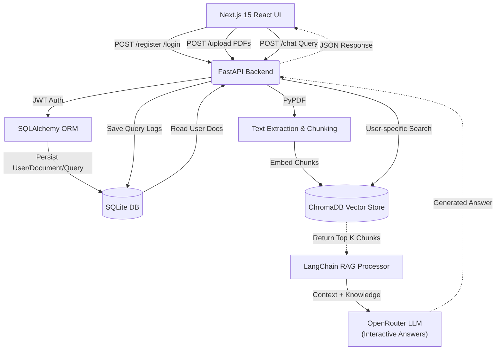

# DocuMind - AI PDF Chatbot v2.0


## Overview

DocuMind is an enterprise-grade, web-based Retrieval-Augmented Generation (RAG) platform. Upload PDFs, authenticate with JWT, and have intelligent conversations with your documents. Built with **user authentication**, **multi-PDF support**, **strict LLM context scoping**, and a **sleek dark UI** inspired by modern SaaS products.

## Key Features ✨

- 🔐 **JWT Authentication** - Secure login/register with password hashing
- 📄 **Multi-PDF Support** - Upload multiple documents simultaneously
- 🚫 **Duplicate Prevention** - Automatically skips already uploaded files
- 🎯 **Interactive Chat** - AI combines document context with general knowledge for helpful answers
- 💾 **Data Persistence** - SQLite database for users, documents, and query history
- 🚀 **Fast Responses** - Optimized vector search with ChromaDB
- 🎨 **Modern UI** - Dark, minimalist design (napkin.ai inspired)
- 📊 **Query History** - Track all conversations per user with tabbed sidebar
- 📖 **Document Summary** - Generate complete summaries of uploaded PDFs
- 💬 **Quoted Replies** - Ask AI about selected text with WhatsApp-style quoted replies
- 🔍 **PDF Viewer** - Built-in PDF viewer with split-screen reading
- 📝 **Highlights & Notes** - Highlight text and add notes to PDFs (stored in database)
- 📥 **Export Options** - Copy, download as PDF, or convert to Word documents
- 🔄 **Resizable Panels** - Smooth drag-to-resize split view for chat and PDF
- 👁️ **Toggle Sidebar** - Show/hide left sidebar panel
- ⚙️ **Settings Page** - Account settings and sign out functionality

## Tech Stack

### Backend
- **FastAPI** (Python) - High-performance async API framework
- **SQLAlchemy** - ORM for database management
- **SQLite** - Lightweight relational database
- **LangChain** - AI orchestration & RAG pipeline
- **ChromaDB** - Vector database for embeddings
- **HuggingFace Transformers** - Local embedding models
- **OpenRouter API** - LLM provider (free tier supported)
- **PyJWT** - JWT authentication
- **Passlib** - Password hashing with bcrypt
- **WeasyPrint** - PDF generation
- **python-docx** - Word document generation

### Frontend
- **Next.js 15** (App Router) - React framework
- **TypeScript** - Type-safe development
- **Tailwind CSS** - Utility-first CSS
- **Framer Motion** - Smooth animations
- **Lucide React** - Modern icons
- **Zustand** - State management
- **Axios** - HTTP client
- **Sonner** - Toast notifications
- **React PDF** - PDF rendering in browser

## Architecture



## Project Structure

```
AI-pdf-chatbot/
│
├── backend/
│   ├── main.py                  # FastAPI app + endpoints
│   ├── models.py                # SQLAlchemy models (User, Document, QueryLog, Highlight, Note)
│   ├── database.py              # Database configuration
│   ├── auth.py                  # JWT & password utilities
│   ├── requirements.txt          # Python dependencies
│   ├── chroma_db/               # Vector database (auto-generated)
│   └── uploads/                 # User PDFs organized by user_id
│
├── frontend/
│   ├── src/
│   │   ├── app/
│   │   │   ├── page.tsx         # Landing page (napkin.ai dark style)
│   │   │   ├── layout.tsx       # Root layout with Toaster
│   │   │   ├── globals.css      # Global styles
│   │   │   ├── auth/
│   │   │   │   ├── login/
│   │   │   │   │   └── page.tsx # Login form
│   │   │   │   └── register/
│   │   │   │       └── page.tsx # Registration form
│   │   │   ├── dashboard/
│   │   │   │   ├── page.tsx     # Main chat dashboard with sidebar
│   │   │   │   └── settings/
│   │   │   │       └── page.tsx # Settings page
│   │   │   └── api/
│   │   │       ├── summary/
│   │   │       │   └── convert/
│   │   │       │       ├── pdf/
│   │   │       │       │   └── route.ts
│   │   │       │       └── word/
│   │   │       │           └── route.ts
│   │   │       └── document/
│   │   │           └── [id]/
│   │   │               └── file/
│   │   │                   └── route.ts  # PDF proxy API
│   │   ├── components/
│   │   │   └── PDFViewer.tsx   # PDF viewer component
│   │   └── lib/
│   │       ├── api.ts           # Axios API client
│   │       └── store.ts         # Zustand state management
│   ├── package.json
│   ├── tsconfig.json
│   └── tailwind.config.ts
│
└── README.md
```

## Setup Instructions

### Prerequisites
- Python 3.11+
- Node.js 18+
- npm or yarn

### Backend Setup

1. **Create virtual environment**
```bash
cd backend
python -m venv venv
source venv/bin/activate  # On Windows: venv\Scripts\activate
```

2. **Install dependencies**
```bash
pip install -r requirements.txt
```

3. **Configure environment**
Create a `.env` file in `backend/`:
```env
OPENROUTER_API_KEY=your_openrouter_key_here
SECRET_KEY=your-super-secret-key-change-in-prod
DATABASE_URL=sqlite:///./vaat_chatbot.db
```

4. **Run the server**
```bash
uvicorn main:app --reload --host 0.0.0.0 --port 8000
```

Backend will be available at `http://localhost:8000`

### Frontend Setup

1. **Install dependencies**
```bash
cd frontend
npm install
```

2. **Configure environment**
Create a `.env.local` file:
```env
NEXT_PUBLIC_API_URL=http://localhost:8000
```

3. **Run dev server**
```bash
npm run dev
```

Frontend will be available at `http://localhost:3000`

## API Endpoints

### Authentication
- `POST /register` - Create new account
- `POST /login` - Login and get JWT token
- `GET /me` - Get current user info (requires auth)

### Documents
- `POST /upload` - Upload multiple PDFs (requires auth)
- `GET /documents` - List user's documents (requires auth)
- `GET /document/{id}/file` - Get PDF file for viewing (requires auth)

### Chat
- `POST /chat` - Send query to chat with PDFs (requires auth)
- `GET /history` - Get query history (requires auth)

### Summary
- `POST /summary` - Generate document summary (requires auth)
- `POST /summary/convert/pdf` - Convert summary to PDF
- `POST /summary/convert/word` - Convert summary to Word

### Highlights & Notes
- `POST /highlights` - Create highlight (requires auth)
- `GET /highlights` - Get highlights (requires auth)
- `DELETE /highlights/{id}` - Delete highlight (requires auth)
- `POST /notes` - Create note (requires auth)
- `GET /notes` - Get notes (requires auth)
- `DELETE /notes/{id}` - Delete note (requires auth)

### Health
- `GET /` - Health check endpoint

## Verification Checklist

- [ ] **Auth**: Register a test user, log in, verify dashboard shows
- [ ] **Multi-Upload**: Select 2+ PDFs and upload simultaneously
- [ ] **Strict LLM**: Ask about "AWS EBS" on a programming PDF, verify refusal
- [ ] **Data Persistence**: Refresh page, verify login session and documents persist
- [ ] **UI Style**: Verify dark, minimal napkin.ai-inspired design
- [ ] **Summary**: Click summary button, verify full document is summarized
- [ ] **Export**: Test Copy, PDF download, and Word download buttons
- [ ] **Quoted Replies**: Select text in PDF viewer, click Ask AI, verify quoted reply
- [ ] **Resizable Panels**: Drag split handle, verify smooth resizing
- [ ] **Toggle Sidebar**: Click sidebar toggle, verify sidebar shows/hides
- [ ] **Highlights & Notes**: Select text in PDF viewer, create highlights and notes

## Environment Variables

### Backend (.env)
```
OPENROUTER_API_KEY=<your_api_key>
SECRET_KEY=<change_in_production>
DATABASE_URL=sqlite:///./vaat_chatbot.db
```

### Frontend (.env.local)
```
NEXT_PUBLIC_API_URL=http://localhost:8000
```

## Future Enhancements

- [ ] Document sharing between users
- [ ] Advanced search filters
- [ ] Custom AI model selection
- [ ] Webhook integrations
- [ ] Team workspaces
- [ ] Rate limiting & usage quotas
- [ ] Real-time collaboration
- [ ] Voice input for questions

## Security Notes

⚠️ **Important**: Change `SECRET_KEY` in production. Never commit `.env` files.

## Troubleshooting

### Backend won't start
```bash
# Check Python version
python --version  # Must be 3.11+

# Reinstall dependencies
pip install -r requirements.txt --force-reinstall
```

### Frontend connection issues
- Ensure backend is running on `http://localhost:8000`
- Check `NEXT_PUBLIC_API_URL` in `.env.local`

### Database errors
```bash
# Remove old database and reinitialize
rm vaat_chatbot.db
python -c "from database import init_db; init_db()"
```

## Contributing

Contributions welcome! Please feel free to submit a Pull Request.

## License

MIT License - see LICENSE file for details

## Support

For issues and questions, please open a GitHub issue.

---

## Deployment Guide

### Option 1: Vercel (Frontend) + Render/Railway (Backend)

#### Backend Deployment (Render.com - Free Tier)

1. **Push your code to GitHub**

2. **Create a new Web Service on Render**
   - Go to https://render.com and connect your GitHub
   - Create a new Web Service
   - Select your repository
   - Build Command: `pip install -r requirements.txt`
   - Start Command: `uvicorn main:app --host 0.0.0.0 --port $PORT`

3. **Environment Variables on Render**
   ```
   OPENROUTER_API_KEY=your_openrouter_key
   SECRET_KEY=your-secret-key
   DATABASE_URL=sqlite:///./documind.db
   ```

4. **Note**: For persistent storage (uploaded PDFs), add a Render Disk or use cloud storage (S3)

#### Frontend Deployment (Vercel)

1. **Push your code to GitHub**

2. **Go to https://vercel.com**
   - Import your repository
   - Framework Preset: Next.js
   - Build Command: `npm run build`
   - Output Directory: `.next`

3. **Environment Variables on Vercel**
   ```
   NEXT_PUBLIC_API_URL=https://your-backend-url.onrender.com
   ```

4. **Deploy**

---

### Option 2: Deploy Both on Railway

1. **Go to https://railway.app**
2. **Deploy Backend**
   - New Project → GitHub Repo
   - Add environment variables
   - Deploy

3. **Deploy Frontend**
   - New Project → GitHub Repo
   - Add environment variables:
     - `NEXT_PUBLIC_API_URL` = your railway backend URL
   - Build Command: `npm run build`
   - Output Directory: `.next`

---

### Important: Database & File Storage

**For Production:**
- Replace SQLite with PostgreSQL (use ` DATABASE_URL=postgresql://...`)
- Use AWS S3 or Cloudinary for PDF file storage
- The ChromaDB vector store should be configured for persistence

**Quick Fix for Now:**
- SQLite will work but won't scale
- Uploaded PDFs are stored locally in `backend/uploads/` - use a mounted volume on Render/Railway

---

**Built with ❤️ using FastAPI, Next.js, and LangChain**
